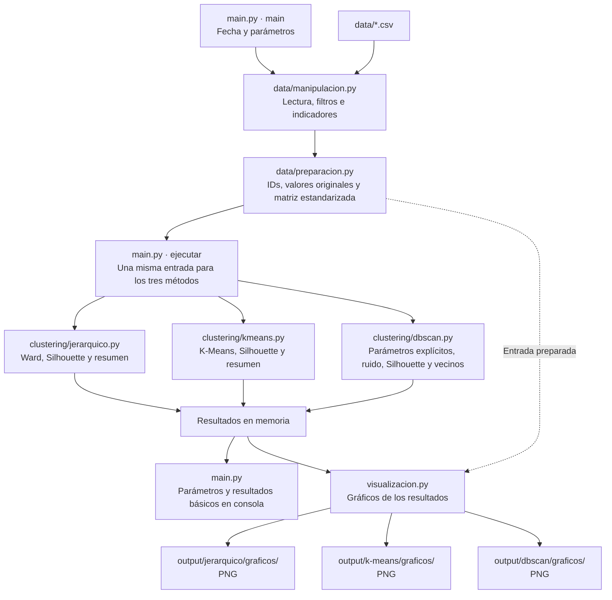

# Flujo actual a nivel de archivos

`main.py` coordina las llamadas y pasa los datos en memoria. Las ramas del diagrama representan el recorrido de los datos: los algoritmos se ejecutan en secuencia.

Cada algoritmo calcula sus etiquetas y resultados básicos: cantidad y medias por grupo, Silhouette individual y promedio. DBSCAN excluye ruido de Silhouette y registra el motivo si no se puede calcular; también devuelve las distancias de vecindad para su gráfico.

`visualizacion.py` genera figuras de tamaños, Silhouette, perfiles, distancias a vecinos y dendrogramas. Los resúmenes y resultados numéricos se muestran en consola y permanecen en memoria. No se generan CSV ni JSON.

La selección de parámetros de DBSCAN es explícita. La ejecución inicial utiliza `eps=1.5` y `min_samples=5`. No hay selección automática, comparación por ARI, tablas de correspondencia ni análisis de estabilidad en este flujo. Los módulos `evaluacion.py` y `exportacion.py` fueron retirados.

LASSO permanece como antecedente independiente.
