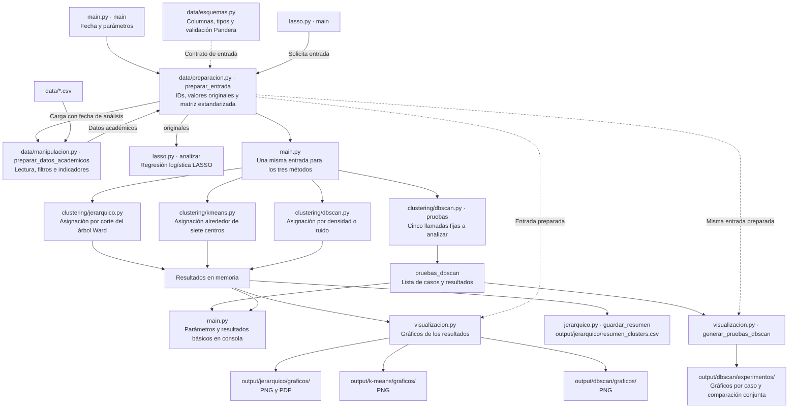

# Flujo actual a nivel de archivos

`main.py` solicita la entrada a `preparacion.py`, que carga los datos mediante `manipulacion.py`. Luego coordina los algoritmos y pasa la entrada en memoria. Los algoritmos se ejecutan en secuencia.

El flujo permite estudiar cómo cambia el agrupamiento al cambiar de método: cada algoritmo recibe la misma matriz de alumnos y atributos. K-Means y DBSCAN no reciben las etiquetas jerárquicas como entrada.

## Entrada común y output que cambia

La preparación conserva IDs y valores originales y produce una matriz estandarizada con diez atributos. La identidad se mantiene por posición en ambas tablas y el vector de IDs. Las etiquetas de clustering quedan fuera de los atributos.

Cada algoritmo calcula una etiqueta por alumno. Al cambiar las asignaciones cambian los tamaños, medias, distribuciones y Silhouette de los grupos. Las etiquetas numéricas son independientes entre métodos. DBSCAN puede producir otra cantidad de grupos y usa `-1` para ruido; lo excluye de Silhouette y registra el motivo cuando no se puede calcular.

Los métodos también devuelven información propia: el enlace y diagnóstico de k del jerárquico, los centros e inercia de K-Means y las distancias de vecindad y cantidad de ruido de DBSCAN.

## Salidas implementadas

`visualizacion.py` genera figuras de tamaños, Silhouette, perfiles, distancias a vecinos y dendrogramas. Los resúmenes y resultados numéricos se muestran en consola y permanecen en memoria. El jerárquico guarda además el resumen CSV original y los dendrogramas internos y zooms en PDF. No se generan tablas comparativas ni JSON.

## Comparación pendiente

La selección de parámetros de DBSCAN es explícita. La ejecución inicial utiliza `eps=1.5` y `min_samples=5`. Además de la ejecución individual, `main` llama a `dbscan.pruebas` para cinco casos fijos sobre la misma entrada. Devuelve esa lista en `pruebas_dbscan`, imprime sus perfiles y comparación, y llama a `visualizacion.generar_pruebas_dbscan` para guardar figuras en `output/dbscan/experimentos/<caso>/graficos/` y una comparación conjunta. Los parámetros CLI modifican solo la ejecución individual. El flujo no incluye tablas de correspondencia, ARI ni repeticiones de sensibilidad. La comparación prevista cruzará asignaciones y describirá qué perfiles se conservan, se dividen, se fusionan o quedan como ruido.

El jerárquico Python se acepta como equivalente al R sobre las entradas verificadas. La reconstrucción de la publicación no es un requisito; ver [criterios del trabajo](../criterios-del-trabajo.md#equivalencia-rpython-y-referencia-de-trabajo).

LASSO permanece como antecedente independiente y toma los valores originales. No aporta etiquetas ni pesos a los algoritmos de clustering.
